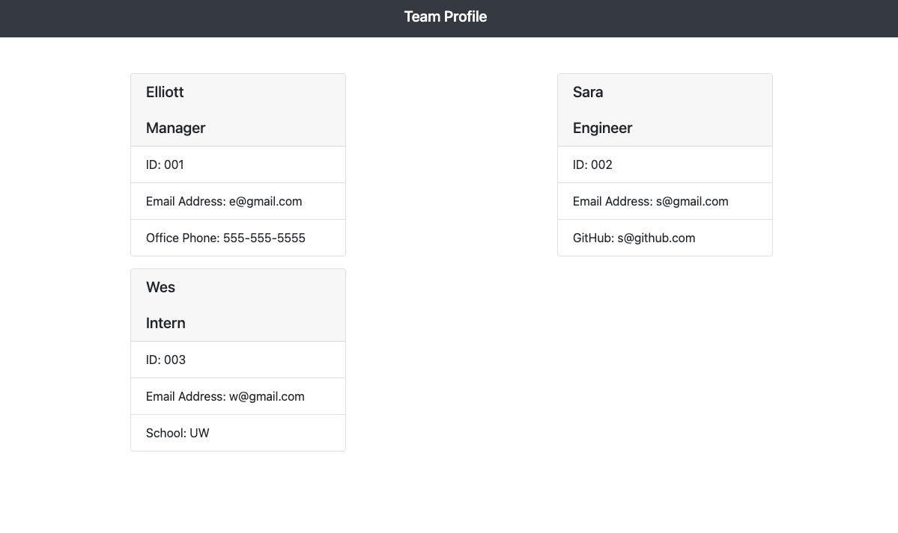
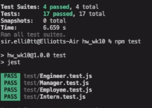

# Object-Oriented Programming: Team Profile Generator - Homework 10, UW Coding Bootcamp


## Description

For week 10 of the UW Coding Bootcamp my homework invited me to build a Team Profile Generator, which is a command-line-input application run in Node.js that requests information from the user about members of an engineering team and generates an HTML file displaying that information. Unit tests written will ensure that each unit passes and the application runs as intended.

This application is not deployed so you will see a link below to a walkthrough video that demonstrates the applications functionality and all of the tests passing. Please find said video and link below in the Usage section.

## Built With

* [Jest](https://www.npmjs.com/package/jest)
* [Inquirer](https://www.npmjs.com/package/inquirer)
* [Node.js](https://nodejs.org/en/)
* [OOP](https://www.freecodecamp.org/news/object-oriented-programming-concepts-21bb035f7260/)
* [W3 Schools](https://www.w3schools.com/nodejs/nodejs_filesystem.asp)
* [Developer Mozilla](https://developer.mozilla.org)

## Link to GitHub Repo

* [See Live Site](https://github.com/spencee1315/hw_10)

## Installation 

Steps to install application:

1. Git Clone (SSH or HTTPS) or Download Repository
2. In the directory with app.js run `npm install`
3. Enter `npm server.js`
4. Open generated HTML

## Usage 

Use inquirer from your command line to answer questions about your project.
View walk through video here - [Screencastify](https://drive.google.com/file/d/1FI_s1k2mU1kK21aeDuGarcslz7457XU-/view)<br>


Upon launching the app, entering `node app.js` in the command line. The user is then prompted to describe the first member of their team. The user enters the team member's name, selects that member's role from a list (options include: "Engineer", "Intern", and "Manager"). Next the user enters the member's ID, email address, and then must enter another piece of information that will differe depending on what role was selected. 

If Engineer - the app asks the user for the team member's GitHub username
If Intern - the members school is requested
If Manager - the user is prompted for the team member's phone number

When all information on the team member has been entered, the user is asked whether there are any more members they would like to add. If so, the user is asked the same questions about the new team member. If not, an HTML file is created with cards displaying the information on all the team members entered by the user in the "outputs" folder titled "team.html".

## Tests
Run `npm test` to run Jest for tests on constructors.

All tests passed, view video here - [Screencastify](https://drive.google.com/file/d/1XWGkyeoJjdE29CWSsF8WCwB91CCGx7ZZ/view)<br>


## Snippet
This a code snippet from the lib, Employee.js file..

```javascript
// import models
// Defining employee class
class Employee {
    constructor (name, id, email) {
        this.name = name;
        this.id = id;
        this.email = email;
    }
    getName() {
        return this.name;
    }
    getId() {
        return this.id;
    }
    getEmail() {
        return this.email;
    }
    getRole() {
        return "Employee";
    }
}

module.exports = Employee;
```

## License 
This project is licensed under MIT

## Contributing 
Contributors should read the installation section. 

### Authors

* **Elliott Spencer**

### Contact Information

* [Link to Portfolio Site](https://spencee1315.github.io/hw_wk2/)

* [Link to Github](https://github.com/spencee1315)

* [Link to LinkedIn](https://www.linkedin.com/in/elliott-spencer-886a9818/)